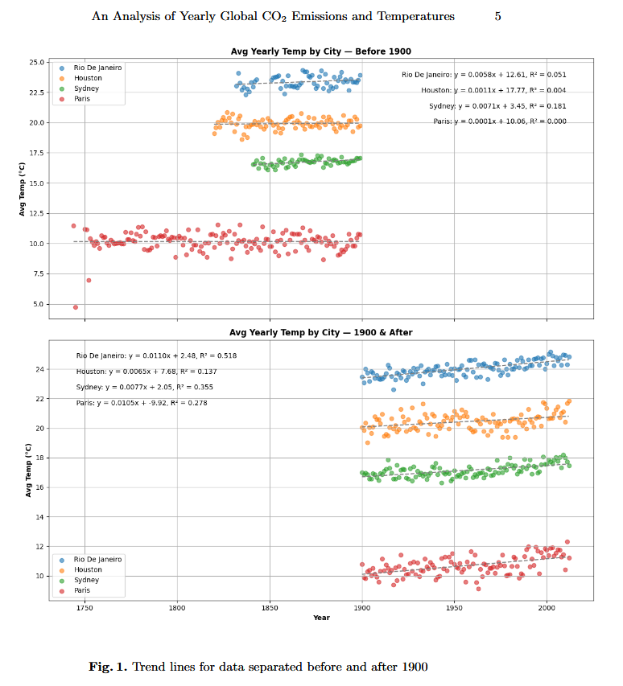
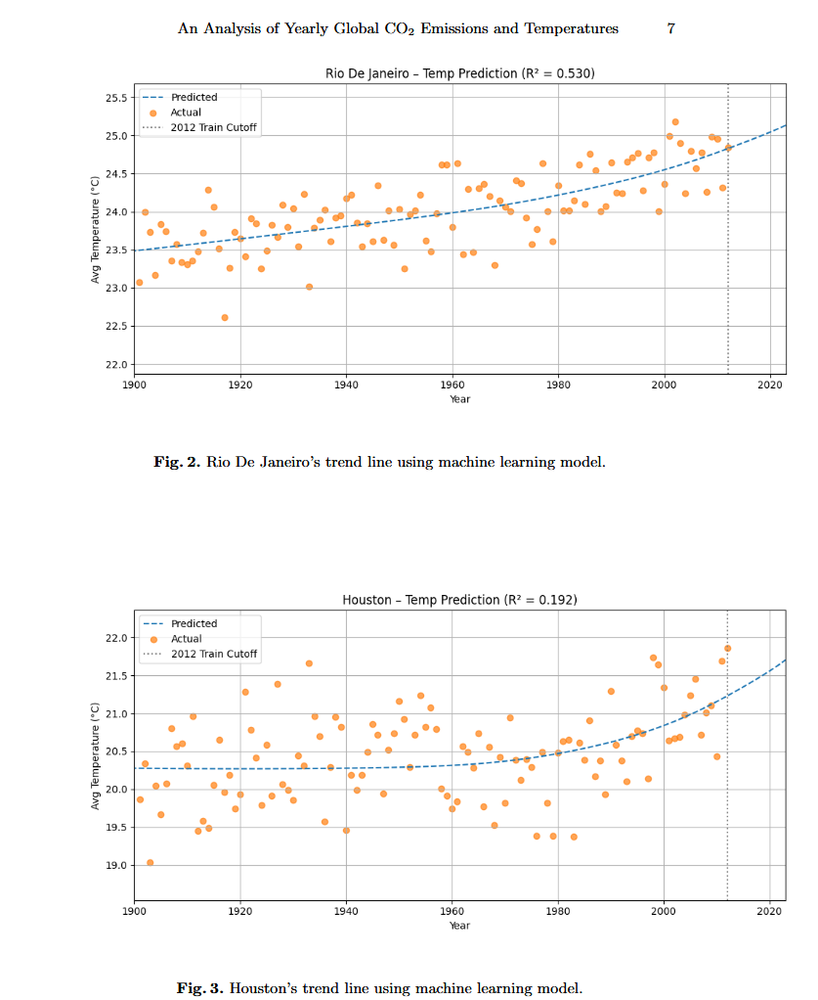

# CO2-Emissions-and-Global-Temperature-Analysis

This project investigates the relationship between rising global CO$_2$ emissions and average annual temperature changes in four major cities: Houston, Paris, Rio de Janeiro, and Sydney. Historical temperature data was combined with cumulative global CO$_2$ emissions to assess long-term trends in climate behavior. Initial linear regression models using time alone revealed modest fits. To improve model performance, a machine learning approach was employed, incorporating both year and cumulative CO$_2$ emissions as predictors. This enhanced model produced moderately higher $R²$ values across all cities, indicating a stronger fit and capturing the increasing rate of temperature rise more effectively. These findings underscore the value of integrating environmental variables into predictive models and highlight the potential for machine learning to improve climate-related forecasting at the local level.

Overleaf link - https://www.overleaf.com/read/cmyyzdjstbjc#02c4a6 

Data used - 
https://www.kaggle.com/datasets/berkeleyearth/climate-change-earth-surface-temperature-data/data  

https://www.kaggle.com/datasets/patricklford/global-co-emissions  

# Creating a virtual environment

python -m venv .venv
.venv\Scripts\Activate   

# Install dependencies

pip install -r requirements.txt

# EDA used

This project primarily utilizes scatter plots to get an initial grasp of the data.

# Advanced EDA 

Machine learning is then implemented to better match trend lines and analyze correlations. Scikit-modeling is used for its ability to match non-linear data.

